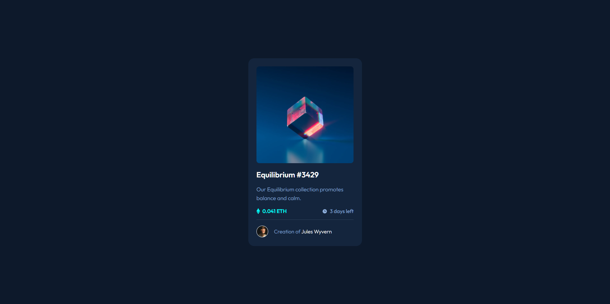

# Frontend Mentor - NFT preview card
This is a solution to the [Product preview card component challenge on Frontend Mentor](https://www.frontendmentor.io/challenges/product-preview-card-component-GO7UmttRfa). This challenge was great for me to use the advice people gave me about my last challenge - which was my first-
## Table of contents
- [Overview](#overview)
  - [Screenshot](#screenshot)
- [My process](#my-process)
  - [Built with](#built-with)
  - [Useful resources](#useful-resources)

## Overview

### Screenshot

This a screenshot of my attempt at recreating the picture given in the exercise

## My process

### Built with

- Semantic HTML5 markup
- CSS custom properties
- Flexbox

(For this project (and the last) I used standalone CSS and HTML without any frameworks/libraries to make sure I got the basics first)

### Useful resources

- [FreeCodeCamp](https://www.freecodecamp.org) - This site is what really made make the decision to start learning web-developement seriously
- [Kevin Powell](https://www.kevinpowell.co) - Kevin is a great teacher in all things CSS, He's thorough but still keeps learning fun. In addition to his site He also has a youtube channel with same name
